# 👤 Nama Kelompok: **AVATAR-ANG**
# 🎓 Kelas: **PBO - A**

## 👥 Anggota Kelompok
| No | Nama     | NPM        | Peran     |
|----|-----------|------------|-----------|
| 1. | Dheka     | 4524210027 | Ketua     |
| 2. | Agis      | 4524210056 | Anggota   |
| 3. | Bryan     | 4524210020 | Anggota   |
| 4. | Ghifari   | 4524210041 | Anggota   |

---

## Class Diagram


---

## Folder Struktur
```bash
./MANUSIA
│   .gitignore
│   README.md
├───scripts
│       runApp.ps1
│       runApp.sh
│
├───src
│   └───com
│       │   App.java
│       │
│       ├───polymorphism
│       │   │   Manusia.java
│       │   │
│       │   ├───ayah
│       │   │       Ayah.java
│       │   │       AyahPekerja.java
│       │   │       AyahWirausaha.java
│       │   │
│       │   └───ibu
│       │           Ibu.java
│       │           IbuKarir.java
│       │           IbuRumahTangga.java
│       │
│       └───services
│               BaseService.java
│               ObjectFactory.java
│               PrinterService.java
│
└───uml
        diagram.svg
```

## ▶️ Cara Menjalankan Program
1. MacOs / Linux:
    ```bash
    ./scripts/runApp.sh
    ```
2. Windows (PowerShell):
    ```powershell
    .\scripts\runApp.ps1
    ```